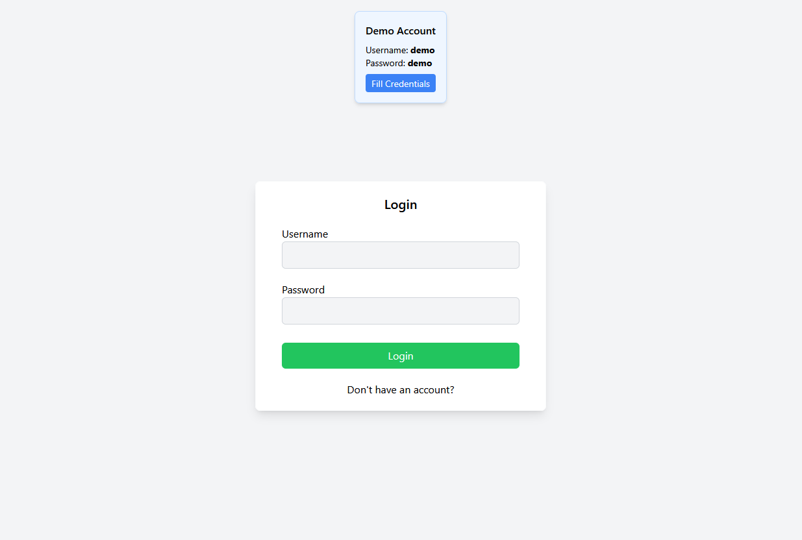
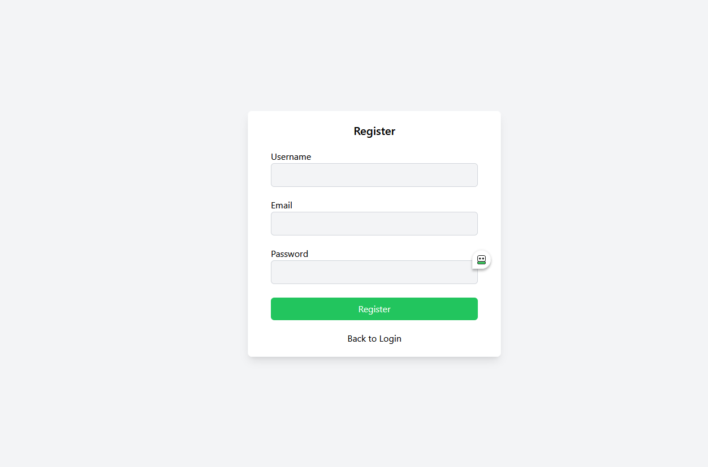
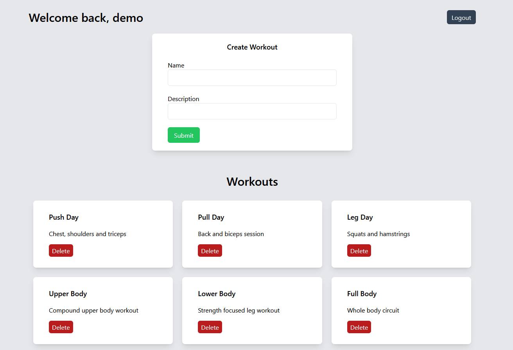

# Overview

A React frontend for the FitnessApp project. It provides user registration, workout management and communicates with the FastAPI backent using JWT authentication.

## Deployment

https://fitness-app-frontend-lilac.vercel.app/

## Features

- Login
- Register
- Persistent login
- Logout
- Create workouts
- Delete workouts
- Responsive layout
- Protected Routes
- React Router navigation
- JWT authentication
- Tailwind CSS styling

## Screenshots

### Login

### Register

### Home

## Tech Stack

- React
- JavaScript
- React Router
- Tailwind CSS
- Vercel
- Fetch API
- JWT Decode

## Deployment

Both the Fitness Tracker frontend and backend are deployed on Vercel. The links are below:

- Frontend - https://fitness-app-frontend-lilac.vercel.app/login
- Backend - https://fitness-app-green-eta.vercel.app/

## Future Improvements

- Edit workouts
- Workout filtering
- Search
- Responsive mobile improvements
- Dark mode